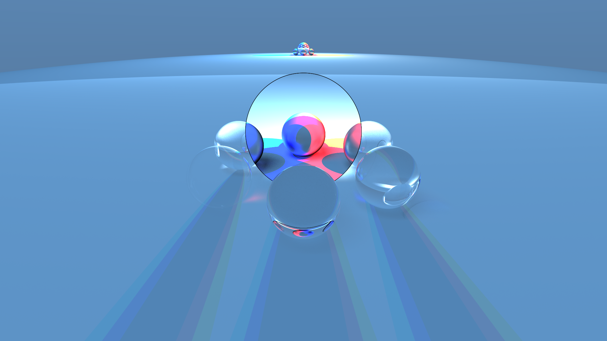

# Raytracing with Rust

- [Images](#images)
- [Animations](#animations)
- [Author](#author)

## Images

## Animations

https://github.com/davidfrk/raytracing/assets/11388028/af88b7cd-b417-4ab9-a286-a260642f110e

https://github.com/davidfrk/raytracing/assets/11388028/10b0d727-4e8b-4173-85f0-d72b652ba10e

https://github.com/davidfrk/raytracing/assets/11388028/f705bb08-ee24-45aa-9b03-4b7b1b8ea6df

## Author

David Andrade.

